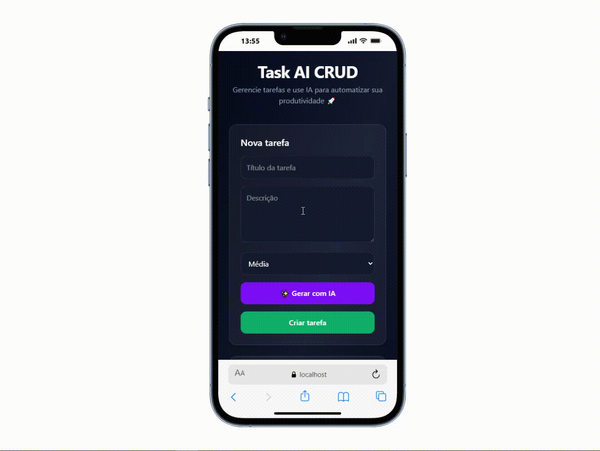

# 🚀 Task AI CRUD

MVP de gerenciamento de tarefas com apoio de IA generativa.

Aplicação fullstack com:

- 🔧 Backend em FastAPI (Python)
- 🎨 Frontend em Angular
- 🤖 IA generativa simulada
- 🧪 Testes unitários (backend e frontend)

---


## 🎥 Demonstração


---


## 📌 Funcionalidades

- ✔ Criar tarefa
- ✔ Listar tarefas
- ✔ Atualizar tarefa
- ✔ Excluir tarefa
- ✔ Marcar como concluída
- ✔ Gerar descrição, prioridade e subtarefas com IA

---

## 🧠 IA Generativa

A funcionalidade de IA foi implementada de forma **simulada** no backend.

### Entrada

```json
{
  "title": "Criar apresentação do MVP"
}
```

### Saída

```json
{
  "description": "Descrição gerada automaticamente para a tarefa: Criar apresentação do MVP",
  "priority": "alta",
  "subtasks": [
    "Pesquisar sobre Criar apresentação do MVP",
    "Organizar os passos para Criar apresentação do MVP",
    "Executar a tarefa Criar apresentação do MVP",
    "Revisar o resultado final"
  ]
}
```

Essa abordagem foi adotada para evitar dependência de APIs externas no MVP, mantendo a arquitetura preparada para integração futura.

---

## ⚙️ Tecnologias

### Backend

- Python
- FastAPI
- SQLAlchemy
- SQLite
- Pytest

### Frontend

- Angular
- Tailwind CSS
- HttpClient
- Jasmine / Karma

---

## 🗂️ Estrutura do Projeto

```
task-ai-crud/
├── backend/
├── frontend/
├── docs/
├── prompts/
└── README.md
```

---

## ▶️ Como rodar o projeto

### 🔧 Backend (FastAPI)

**1. Acesse a pasta**

```bash
cd backend
```

**2. Crie o ambiente virtual**

```bash
python -m venv venv
```

**3. Ative o ambiente**

Windows:

```bash
venv\Scripts\activate
```

**4. Instale as dependências**

```bash
pip install -r requirements.txt
```

Caso não exista o `requirements.txt`:

```bash
pip install fastapi uvicorn sqlalchemy pydantic pytest httpx python-dotenv
```

**5. Rode a API**

```bash
python -m uvicorn main:app --reload
```

**6. Acesse a documentação**

```
http://localhost:8000/docs
```

---

### 🎨 Frontend (Angular)

**1. Acesse a pasta**

```bash
cd frontend/task-ai-front
```

**2. Instale as dependências**

```bash
npm install
```

**3. Rode o projeto**

```bash
npm start
```

**4. Acesse a aplicação**

```
http://localhost:4200
```

---

## 🔗 Integração

O frontend consome o backend em:

```
http://localhost:8000/tasks
```

Certifique-se de que o backend esteja rodando antes do frontend.

---

## 🧪 Testes

### Backend

```bash
cd backend
pytest -v
```

### Frontend

```bash
cd frontend/task-ai-front
npm test
```

---

## 📚 Documentação

### 📁 Prompts utilizados

- `prompts/01-criacao-api.md`
- `prompts/02-arquitetura.md`
- `prompts/03-ia.md`
- `prompts/04-testes.md`
- `prompts/05-frontend-angular.md`
- `prompts/06-ui-tailwind.md`
- `prompts/07-testes-frontend.md`

### 📁 Decisões técnicas

- `docs/decisoes.md`
- `docs/decisoes-frontend.md`

---

## 📊 Arquitetura

**Fluxo principal:**

```
Angular → Controller → Service → Repository → SQLite
```

**Fluxo da IA:**

```
Angular → Controller → Service → AI Service → Response
```

---

## 🧠 Uso de IA no projeto

A IA generativa foi utilizada para:

- Criação da estrutura do backend
- Organização da arquitetura em camadas
- Geração de testes unitários
- Construção do frontend Angular
- Criação da interface com Tailwind
- Geração de documentação e diagramas

---

## ⚠️ Observações

- Projeto desenvolvido como MVP acadêmico
- IA simulada para evitar dependências externas
- Arquitetura preparada para futura integração com APIs reais

---

## 👩‍💻 Autora

**Isabela Santos**  
Desenvolvedora Frontend